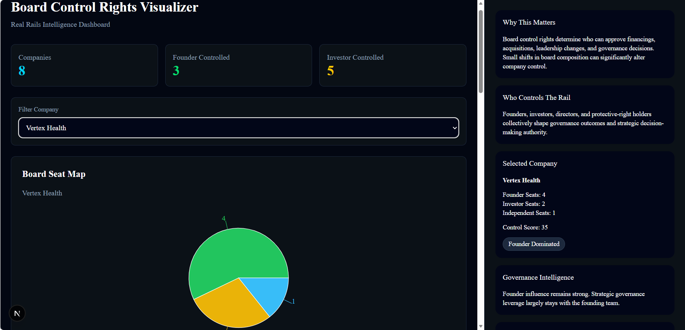

# Board Control Rights Visualizer

Infocreon Internship – Cinematic Intelligence Platform for visualizing board governance structures, voting power, protective rights, investor influence, and control-rights intelligence within venture-backed companies.

---

## Dashboard Preview



---

# Overview

Board Control Rights Visualizer is a governance intelligence platform designed to analyze how board composition, voting power, investor influence, protective rights, and governance structures affect strategic decision-making within venture-backed companies.

Built under the Capital Formation rail, the platform helps users understand how governance control shifts between founders, investors, and independent directors throughout different funding stages.

The platform transforms governance structures into interactive analytics, simulations, and visualizations that support governance analysis, board-control assessment, and strategic decision-making.

---

# Problem Statement

Ownership percentage alone does not determine control within venture-backed companies.

Board seats, voting rights, governance agreements, and protective provisions often have greater influence over strategic decisions such as:

* Raising new financing
* Budget approvals
* Acquisitions and mergers
* Board expansion
* Executive leadership changes

Understanding who truly controls a company can be difficult because governance information is often fragmented across legal agreements and disclosure documents.

Board Control Rights Visualizer provides a centralized governance intelligence layer that makes governance structures easier to understand, compare, and analyze.

---

# Objectives

The platform is designed to:

* Visualize board composition and governance control
* Analyze voting power distribution
* Identify governance concentration and majority control
* Compare founder and investor influence
* Simulate governance approval scenarios
* Track governance evolution across funding stages
* Highlight governance risks and alerts
* Provide governance intelligence and educational context
* Support governance-focused decision analysis

---

# Key Features

## Board Seat Map

Interactive visualization of:

* Founder Seats
* Investor Seats
* Independent Director Seats

---

## Voting Power Breakdown

Calculates voting influence percentages for:

* Founders
* Investors
* Independent Directors

---

## Board Majority Analysis

Determines:

* Total Board Seats
* Majority Threshold
* Governance Control Classification

---

## Founder vs Investor Control Meter

Calculates governance influence directly from board composition and visualizes:

* Founder Control Percentage
* Investor Control Percentage

---

## Governance Health Score

Evaluates governance quality using:

* Board Balance
* Independent Representation
* Governance Concentration

---

## Decision Approval Simulator

Simulates governance outcomes for:

* Budget Approval
* New Financing
* Acquisition Approval
* Board Expansion

Features:

* Decision-specific voting thresholds
* Governance-right validation
* Supporting-group identification
* Approval and rejection outcomes

---

## Scenario Compare

Compares:

* Current Governance Structure
* Proposed Governance Structure

Highlights governance shifts and potential changes in control.

---

## Governance Timeline

Tracks governance progression through:

* Seed
* Series A
* Series B
* IPO

Timeline updates dynamically based on the selected company.

---

## Protective Rights Checklist

Displays governance protections including:

* Budget Approval Rights
* Financing Approval Rights
* Board Approval Rights
* Acquisition Approval Rights

---

## Dynamic Governance Intelligence Panel

Provides governance context through:

* Why This Matters
* Who Controls The Rail
* Governance Intelligence
* Governance Impact
* Governance Alerts
* Governance Timeline
* Dataset Summary
* Source Context

The panel opens dynamically based on user interaction and can be dismissed at any time.

---

## Governance Alerts

Automatically identifies:

* Founder Majority Situations
* Investor Majority Situations
* Protective Rights Requirements
* Independent Director Presence

Alerts update dynamically based on company governance structures.

---

## Data Source Status

Provides transparency regarding the governance data source:

* Governance Adapter Status
* Synthetic Fallback Status
* Data Processing Context

---

## Data Export

Supports:

* JSON Export
* CSV Export

Allowing governance records to be downloaded for further analysis.

---

# Local-to-Cloud Mirror

This project has been containerized using Docker to provide a portable Linux-based runtime environment that mirrors Azure deployment behavior.

### Docker Components

* Frontend Container (Next.js)
* Backend Container (FastAPI)
* Docker Compose Orchestration
* Linux-Based Runtime Environment

### Container Validation

* Frontend Container Running
* Backend Container Running
* API Communication Verified
* Container Restart Validation Passed
* Local Cloud-Mirror Environment Operational

### Status

**Local Container Live**

---

# Data Sources

## Governance Adapter Layer

The backend implements a governance adapter layer that attempts governance data retrieval and automatically falls back to synthetic governance datasets when external governance feeds are unavailable.

---

## Reference Context

Governance concepts are inspired by:

* SEC EDGAR governance disclosures
* Venture financing governance structures
* Board-control frameworks used in capital formation

---

## Demonstration Dataset

This project uses synthetic governance datasets to simulate:

* Board compositions
* Governance structures
* Voting power distribution
* Protective rights
* Investor influence scenarios
* Governance-stage progression
* Balanced Governance Companies

Synthetic data is clearly labeled and used solely for demonstration and educational purposes.

---

# Cinematic Interface

The application follows the Infocreon Cinematic Interface standard.

### Full-Screen Visualization Experience

* Board Seat Map
* Voting Power Analytics
* Governance Simulations
* Governance Health Score
* Control Meter
* Scenario Comparison

### Dynamic Intelligence Panel

* Governance Intelligence
* Governance Alerts
* Governance Timeline
* Dataset Summary
* Source Context
* Governance Impact

### Developer Signature

* Name: Gopika T P
* Batch: Batch 3 Interns

---

# Dashboard Architecture

## Frontend

* Next.js
* TypeScript
* Tailwind CSS
* shadcn/ui
* Recharts

---

## Backend

* FastAPI
* Python
* Requests

---

## Data Layer

* Governance Adapter Service
* SEC EDGAR Integration Stub
* Governance Metrics Service
* Synthetic Dataset Fallback Layer

---

## Container Layer

* Docker
* Docker Compose
* Multi-Stage Frontend Build
* Linux-Based Containers

---

# Architecture Flow

Governance Dataset

↓

Governance Adapter Layer

↓

FastAPI APIs

↓

Docker Backend Container

↓

Docker Network

↓

Docker Frontend Container

↓

Next.js Dashboard

↓

Governance Intelligence Visualizations

↓

User Analysis & Decision Support

---

# Project Structure

```text
POC-84-Board-Control-Rights-Visualizer-Gopika-phase2

├── backend
│   ├── Dockerfile
│   └── .dockerignore
│
├── frontend
│   ├── Dockerfile
│   └── .dockerignore
│
├── screenshots
├── docker-compose.yml
├── README.md
├── VAR_REPORT.md
├── UAT_CHECKLIST.md
└── .gitignore
```

---

# API Endpoints

## Metrics

```http
GET /api/metrics
```

## Companies

```http
GET /api/companies
```

## Rights

```http
GET /api/rights
```

---

# Docker Setup

## Build & Run Containers

```bash
docker compose up --build
```

---

## Stop Containers

```bash
docker compose down
```

---

## Frontend

```text
http://localhost:3000
```

---

## Backend

```text
http://localhost:8000
```

---

# Local Setup (Non-Docker)

## Backend

```bash
cd backend
pip install -r requirements.txt
uvicorn app.main:app --reload
```

---

## Frontend

```bash
cd frontend
npm install
npm run dev
```

---

# Validation

The repository includes:

* VAR_REPORT.md
* UAT_CHECKLIST.md

These documents validate:

* Governance analytics
* Visualization quality
* User interaction
* Dynamic intelligence workflows
* Governance simulations
* Docker containerization
* Local cloud-mirror deployment
* Cinematic interface compliance

---

# Author

**Gopika T P**

**POC 84 – Board Control Rights Visualizer**

**Infocreon Internship – Batch 3 Interns**
